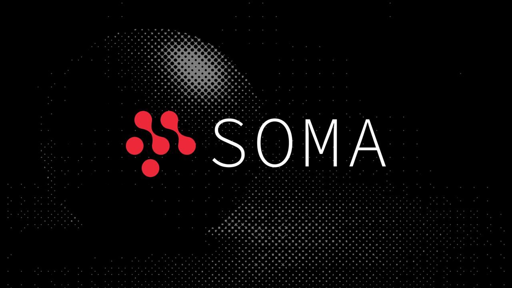

# SOMA

## Overview

**SOMA is a Bittensor subnet focused on context compression for AI agents.**

Modern AI agents repeatedly send large amounts of context to language models: conversation history, tool outputs, repository files, previous actions, and intermediate state. As tasks become longer and more complex, this context grows rapidly, increasing inference cost and limiting how efficiently agents can operate.

SOMA creates an open competition for developing better ways to compress this context.

Miners build **compression algorithms, models, and hybrid approaches** designed to reduce the number of tokens processed by an agent while preserving its ability to complete real tasks.

These solutions are evaluated against uncompressed baselines on real agent workloads, with performance measured across both:

- **agent task quality**
- **weighted token consumption**

The strongest approaches can contribute to SOMA's production compression infrastructure.

**Agent → SOMA → LLM**

## Vision

AI agents are becoming one of the largest consumers of LLM inference.

Unlike simple chat interactions, agents can make dozens or hundreds of model calls while completing a single task. Each call may require sending significant parts of the agent's previous context again.

SOMA aims to build an open research and incentive layer for making those agents significantly more compute-efficient.

Our long-term goals are to:

- reduce the amount of context required by AI agents without degrading task performance
- continuously discover better compression strategies through miner competition
- combine algorithmic compression with compression models
- evaluate compression on real agent workloads rather than static text benchmarks alone
- support more models, agent harnesses, and inference providers
- turn successful research into infrastructure that developers can use in production

SOMA's objective is not simply to maximize compression ratio.

The objective is to find the **maximum useful compression an AI agent can sustain while continuing to complete real work.**

## Architecture

### Platform

The SOMA platform coordinates the competition and evaluation infrastructure.

It is responsible for:

- **Algorithm Registry**: Managing compression models and algorithms submitted by miners
- **Miner Registration**: Associating submissions with registered miner hotkeys
- **Competition Management**: Managing submission, screening, qualification, and evaluation cycles
- **Evaluation Orchestration**: Coordinating agent tasks and evaluation workloads across validators
- **Analytics Dashboard**: Providing competition and performance metrics
- **Scoring Infrastructure**: Aggregating evaluation results used for competition rankings

### Validators

Validators evaluate miner compression solutions against standardized agent workloads.

Depending on the active competition, validators:

- execute agent tasks with miner compression enabled
- compare results against an uncompressed baseline
- measure agent task performance
- measure weighted token consumption
- aggregate results across tasks and repeated runs
- report scores used to calculate competition rankings and subnet weights

The evaluation framework is designed to reward solutions that reduce inference usage **without sacrificing agent performance**.

**Minimum Hardware Requirements:**

- 4 CPU cores
- 16 GB RAM
- 500 GB SSD storage

[**→ Validator Setup Guide**](docs/validator/validator-setup.md)

### Miners

Miners develop techniques for making AI agents more token-efficient.

A miner submission may use should be consistent with the [**→ Rules**](miner/README_prompting.md)

The miner's responsibility is to build a solution that reduces the amount of context processed by the agent while preserving its ability to successfully complete the underlying task.

**All a miner needs to participate is:**

- a working compression solution compatible with the active competition
- a registered hotkey on netuid 114

Submissions are uploaded to the SOMA platform and associated with the miner's hotkey.

The platform and validators handle task execution, baseline comparison, evaluation, and scoring.

[**→ Miner Setup Guide**](docs/miner/miner-setup.md)

## Evaluation

Compression is evaluated relative to an **uncompressed baseline**.

A miner should not receive a strong score simply because it removes a large number of tokens. The compressed agent must still be able to perform the task successfully.

Evaluation therefore considers both **quality and efficiency**.

Core signals include:

- **Task Performance** - whether the agent successfully completes the task
- **Weighted Token Consumption** - how many effective tokens are consumed during the run
- **Token Savings** - reduction relative to the uncompressed baseline
- **Quality Preservation** - whether compression causes previously successful tasks to fail
- **Consistency** - whether results remain stable across multiple tasks and repeated runs

Weighted token accounting can distinguish between different token categories such as:

- input tokens
- cached input tokens
- output tokens

This allows SOMA to evaluate the real economic impact of a compression strategy rather than relying only on raw token counts.

## Competition Cycle

Each competition consists of several stages.

### 1️⃣ Submission Window

During the submission period:

- miners upload their compression solutions
- submissions are associated with registered hotkeys
- miners can test and iterate on their approaches
- only eligible submissions advance to evaluation

### 2️⃣ Screening & Qualification

Before full evaluation, submissions go through automated checks.

Screening is designed to verify that a solution:

- executes correctly
- preserves basic agent functionality
- does not introduce unacceptable quality regressions
- satisfies the technical and competition-specific requirements

Qualification may use additional tasks to determine which submissions advance to full evaluation.

### 3️⃣ Evaluation

Qualified miners are evaluated on a larger set of agent tasks.

Each miner is compared against an uncompressed baseline under the same evaluation setup.

Multiple tasks and repeated runs are used where appropriate to reduce variance and provide a more reliable estimate of compression performance.

### 4️⃣ Review & Rewards

Top-performing submissions undergo additional code and integrity review.

Final competition results determine subnet incentives according to the active incentive mechanism.

[**→ Incentive Mechanism**](docs/miner/INCENTIVE_MECHANISM.md)

