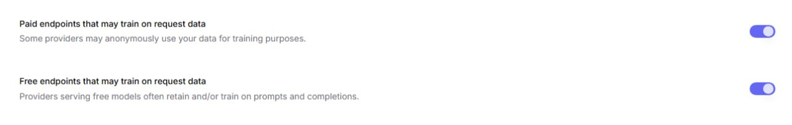

# 🔧 OpenRouter Setup

> **Required configuration for the new competition**

For the new competition, we will be using **DeepSeek V4 Pro** via the **DeepSeek** provider on OpenRouter.

To participate, you must enable **Data Collection** for the DeepSeek provider in your OpenRouter settings.

## ⚙️ Setup Instructions

1. Go to **Settings → Privacy**.
2. Enable both **Data Collection** options:
   - **Paid endpoints that may train on request data**
   - **Free endpoints that may train on request data**
3. Go to **Settings → Guardrails**.
4. Select your **Workspace**.
5. Open **Model and Provider Access** and make sure the **DeepSeek** provider is enabled.

## ❓ Why is this required?

Our gateway is configured to use the DeepSeek provider. Enabling these settings helps:

- Ensure compatibility with the competition infrastructure.
- Reduce evaluation costs for miners.
- Provide a more stable inference endpoint.
